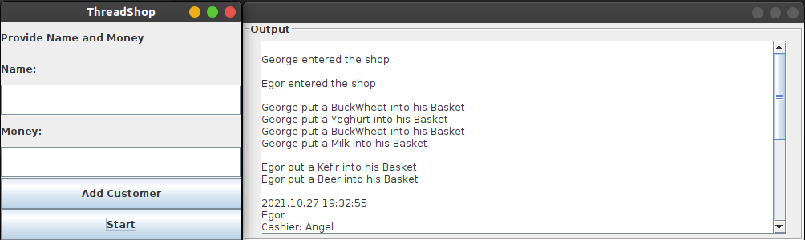

# Thread Shop

## Idea
  This is my personal project, that demostrates multiple threads behavior. 
  Main goals are to provide example of multithreading, synchronization and practice this programming field.
  
  For example customers(Polina, George, Egor, Klim, Fedya) visit the shop in that order.
  But result order could be very different:
  
|  In  | Out  |
| ------------- | -------------- |
| Polina | Polina  |
| George   | Klim |
| Egor | Egor |
| Klim   |Fedya |
| Fedya   |George |----------------------------

## Technologies and Features
  - Java `Threads`
  - `Gradle` to build and run the application
  - Graphical Interface provided by `java-swing`

## Author
**[George Krovsh](https://github.com/gosha-krovsh)**
